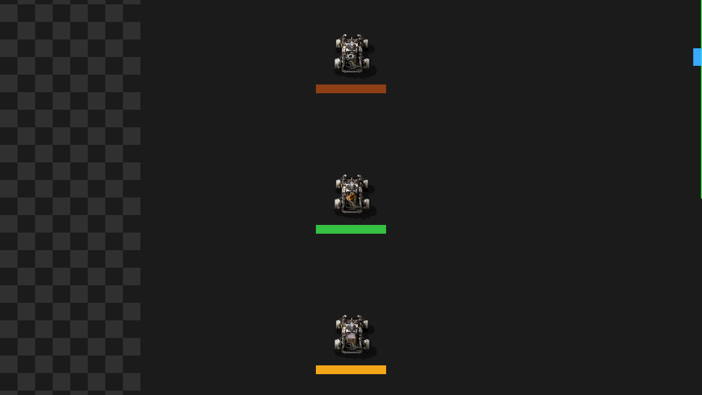

# Disposable tractor implement overlays

The production slice still has one generic physical `farming-tractor`. Its
cultivation, sowing, and harvesting implements remain logical capability
profiles on the machine record. No implement item, entity, collision,
inventory, attachment physics, or gameplay state was added.

An assigned tractor projects two attached render objects derived from its
current job operation:

- a tinted bar spanning the fixed four-tile work width;
- a distinct base-game item badge for cultivation, sowing, or harvesting.

The projection follows the tractor through the rendering API's target and
target-orientation support. Completion, assignment failure, destruction, or
loss of assignment destroys it. Load and configuration recovery discard and
rebuild every overlay from the authoritative machine-to-job relationship.

The serialized repository harness checks idle absence, three-operation fleet
concurrency, attachment identity, width, reset/rebuild, isolated destruction,
save/load regression, and performance. It also performs a real graphics launch
at ordinary zoom and captures the evidence below.

